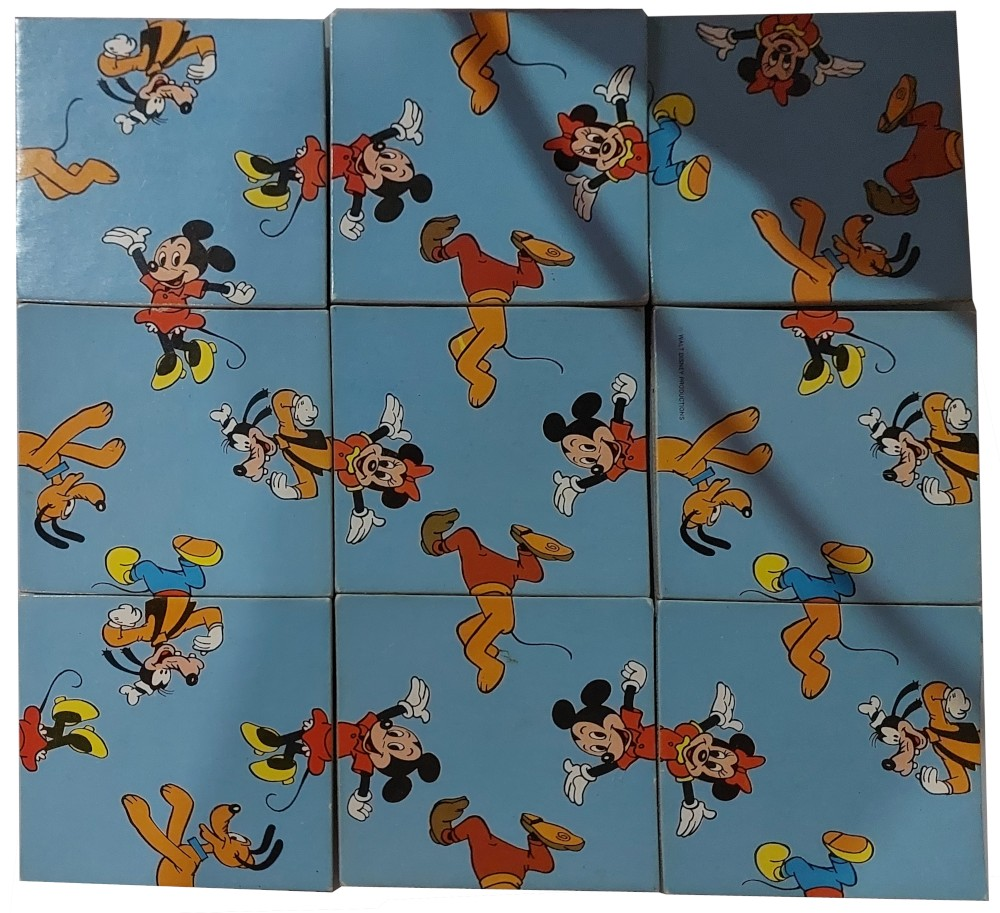
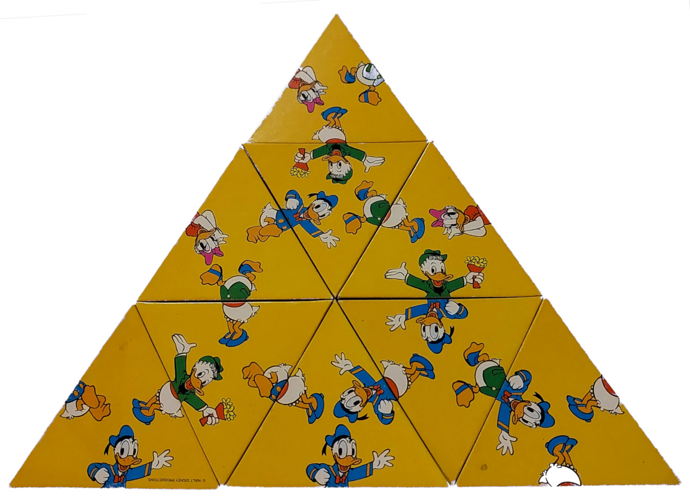
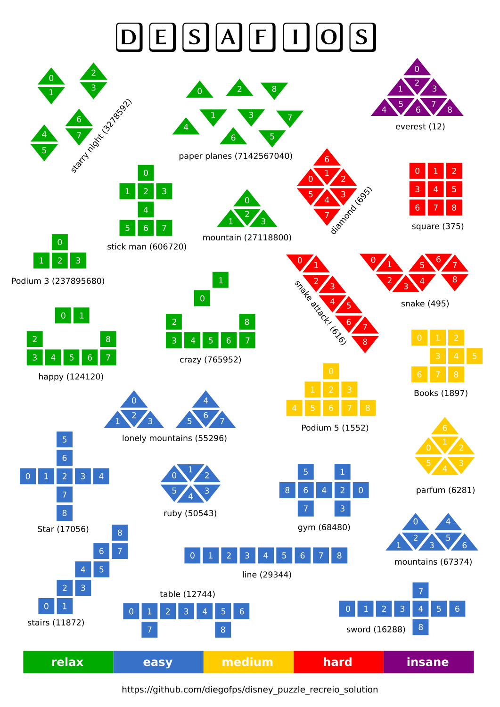

# About this Project

This project provides simple recursive algorythms to find all solutions for the old board game "Desafio". The search is optimized by discarding invalid combinations as soon as they appear.

# About the Game

The puzzle is composed by 2 sets of keys, squares and triangles, each of them contains 9 pieces. Originally, the game challenges the user to assemble a larger square and a larger triangle. To finish the puzzle the user must correctly match every cartoon in the pieces. The larger triangle is harder as the number of solutions is considerably lower. 

|  |  |
| :---: | :---: |
| *Square puzzle* | *Triangular puzzle* |


# Extra Patterns

To make it easier for younger kids, I built a set of new patterns that are compatible with the original cards. Then, I clustered them according to their difficulty. The difficulty is measured according to the number of possible solutions in the puzzle (the number in parenthesis). 



# Executing the Solvers

To execute a solver, access the solvers folder and execute the file with its pattern name. This project has no dependencies, except for Python itself. For instance, to solve the full triangle, we would do:

```
cd solvers
python ./triangle.py
```

Patterns with a few thousand solutions will likely show all of them. Patterns with many of them will display the first one and trhe number of solutions found.